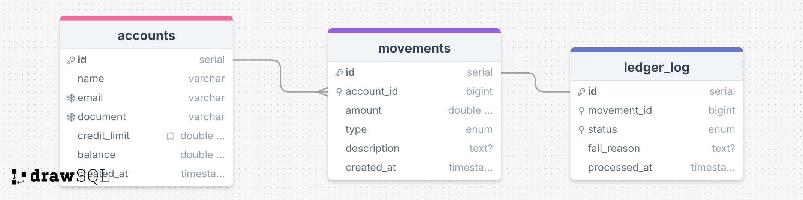

# Mini Ledger

## 📁 Download da API

Para facilitar os testes, aqui está a collection completa para importar no Postman.
**📂 Arquivo:** 
- [📥 **Download Collection**](./arquivos/MINILEDGER.postman_collection.json?raw=true) (Clique para baixar)
- [👁️ **Visualizar**](./arquivos/MINILEDGER.postman_collection.json) (Ver conteúdo)

## 🏗️ Arquitetura

- **Backend**: NestJS com TypeScript
- **Banco de Dados**: PostgreSQL com Prisma ORM
- **Message Queue**: RabbitMQ para processamento assíncrono de logs
- **Containerização**: Docker e Docker Compose

## 🚀 Como Inicializar o Projeto

### Pré-requisitos
- Docker
- Docker Compose

### Passos para execução

1. **Clone o repositório**
```bash
git clone git@github.com:allanvigiani/mini-ledger.git
cd mini-ledger
```

2. **Execute o projeto com Docker Compose**
```bash
sudo docker-compose up --build
```

3. **Acesse a aplicação**
- API: `http://localhost:3000`
- RabbitMQ Management: `http://localhost:15672` (guest/guest)

### Serviços disponíveis

- **PostgreSQL**: Porta 5432
- **RabbitMQ**: Porta 5672 (AMQP) e 15672 (Management UI)
- **API NestJS**: Porta 3000

## 📚 Documentação da API

### 🏦 Accounts (Contas)

#### 1. Criar uma conta
```bash
curl -X POST http://localhost:3000/accounts \
  -H "Content-Type: application/json" \
  -d '{
    "name": "João Silva",
    "email": "joao@email.com",
    "document": "12345678901",
    "credit_limit": 1000
  }'
```

**Campos obrigatórios:**
- `name`: Nome (mínimo 2 caracteres)
- `email`: Email válido
- `document`: Documento (mínimo 11 caracteres)

#### 2. Listar todas as contas
```bash
curl -X GET http://localhost:3000/accounts
```

#### 3. Buscar conta por ID
```bash
curl -X GET http://localhost:3000/accounts/{ACCOUNT_ID}
```

#### 4. Consultar saldo e limite de uma conta
```bash
curl -X GET http://localhost:3000/accounts/{ACCOUNT_ID}/balance
```

### 💸 Movements (Movimentações)

#### 1. Criar uma movimentação
```bash
# Débito
curl -X POST http://localhost:3000/movements \
  -H "Content-Type: application/json" \
  -d '{
    "account_id": "123e4567-e89b-12d3-a456-426614174000",
    "amount": 100.50,
    "type": "DEBIT",
    "description": "Compra no supermercado"
  }'

# Crédito
curl -X POST http://localhost:3000/movements \
  -H "Content-Type: application/json" \
  -d '{
    "account_id": "123e4567-e89b-12d3-a456-426614174000",
    "amount": 200.00,
    "type": "CREDIT",
    "description": "Depósito"
  }'
```

**Campos obrigatórios:**
- `account_id`: ID da conta (UUID)
- `amount`: Valor (mínimo 0.01)
- `type`: Tipo da movimentação (`CREDIT` ou `DEBIT`)

**Campos opcionais:**
- `description`: Descrição da movimentação

#### 2. Listar movimentações de uma conta
```bash
curl -X GET http://localhost:3000/movements/account/{account_id}
```

## 🐰 RabbitMQ Consumer

O sistema possui um consumer que processa logs de movimentações de forma assíncrona.

### Como funciona

1. **Execução automática**: O consumer roda a cada 10 segundos via `setInterval`
2. **Fila**: Consome mensagens da fila `log.pubsub`
3. **Retry automático**: Implementa sistema de retry com até 3 tentativas usando `.nack()`
4. **Persistência**: Salva os logs na tabela `ledger_log`

### Estrutura das mensagens na fila

```json
{
  "movement_id": 123,
  "status": "PROCESSED",
  "fail_reason": "Motivo da falha (opcional)"
}
```

### Status possíveis
- `PROCESSED`: Movimentação processada com sucesso
- `FAILED`: Movimentação falhou
- `BLOCKED`: Movimentação bloqueada (limite insuficiente)
- `APPROVED`: Movimentação aprovada
- `PENDING`: Movimentação pendente

### Fluxo de retry

1. **1ª tentativa**: Tenta salvar o log
2. **Erro**: Incrementa contador no header da mensagem e republica
3. **2ª tentativa**: Nova tentativa de processamento
4. **3ª tentativa**: Última tentativa
5. **Falha final**: Mensagem é rejeitada definitivamente (`.nack()` sem requeue)

### Logs do consumer

Para visualizar os logs do consumer em tempo real:

```bash
# Todos os logs da aplicação
sudo docker-compose logs -f app

# Apenas logs do RabbitMQConsumerService
sudo docker-compose logs -f app | grep "RabbitMQConsumerService"

# Logs específicos de processamento
sudo docker-compose logs -f app | grep "Processando mensagem"
```

## 🗄️ Estrutura do Banco de Dados

### Tabelas principais

- **accounts**: Contas dos usuários
- **movements**: Movimentações financeiras
- **ledger_log**: Logs de auditoria das movimentações

### Relacionamentos

- Uma conta pode ter várias movimentações
- Cada movimentação pode ter um log de auditoria

### 📊 Diagrama de Relacionamento

<p align="center">
  
</p>

*Diagrama mostrando a estrutura e relacionamentos entre as tabelas do sistema*

## 🧪 Testando o Sistema

### Cenário completo de teste

1. **Criar uma conta**
```bash
curl -X POST http://localhost:3000/accounts \
  -H "Content-Type: application/json" \
  -d '{
    "name": "Teste User",
    "email": "teste@email.com",
    "document": "12345678901",
  }'
```

2. **Fazer um depósito (crédito)**
```bash
curl -X POST http://localhost:3000/movements \
  -H "Content-Type: application/json" \
  -d '{
    "account_id": "{ACCOUNT_ID_RETORNADO}",
    "amount": 50.00,
    "type": "CREDIT",
    "description": "Depósito inicial"
  }'
```

3. **Fazer uma compra (débito)**
```bash
curl -X POST http://localhost:3000/movements \
  -H "Content-Type: application/json" \
  -d '{
    "account_id": "{ACCOUNT_ID_RETORNADO}",
    "amount": 25.00,
    "type": "DEBIT",
    "description": "Compra online"
  }'
```

4. **Verificar saldo**
```bash
curl -X GET http://localhost:3000/accounts/{ACCOUNT_ID}/balance
```

5. **Ver movimentações**
```bash
curl -X GET http://localhost:3000/movements/account/{ACCOUNT_ID}
```

## 🛠️ Tecnologias Utilizadas

- **NestJS**: Framework Node.js para construção de APIs
- **TypeScript**: Linguagem principal
- **Prisma**: ORM para PostgreSQL
- **PostgreSQL**: Banco de dados relacional
- **RabbitMQ**: Message broker para processamento assíncrono
- **Docker**: Containerização
- **Class Validator**: Validação de dados
- **ESLint + Prettier**: Qualidade e formatação de código

## 📦 Estrutura do Projeto

```
src/
├── accounts/           # Módulo de contas
├── movements/          # Módulo de movimentações
├── rabbitmq/           # Módulo RabbitMQ (consumer e publisher)
├── common/             # Serviços compartilhados (Prisma)
└── main.ts             # Arquivo principal
```

### Acessar RabbitMQ Management
- URL: http://localhost:15672
- Usuário: guest
- Senha: guest
